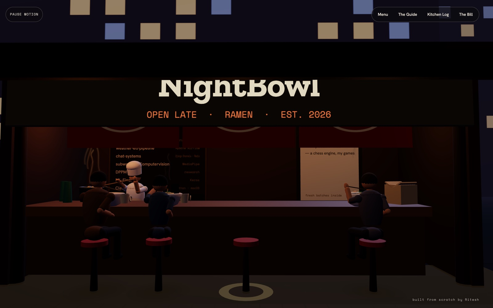
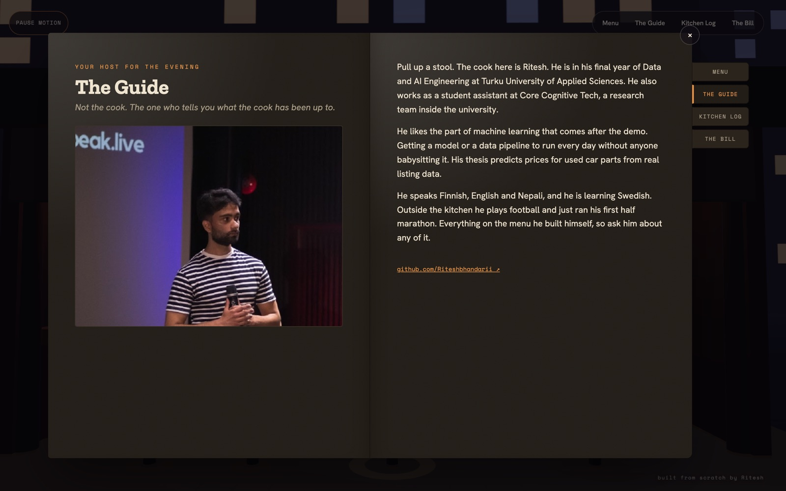
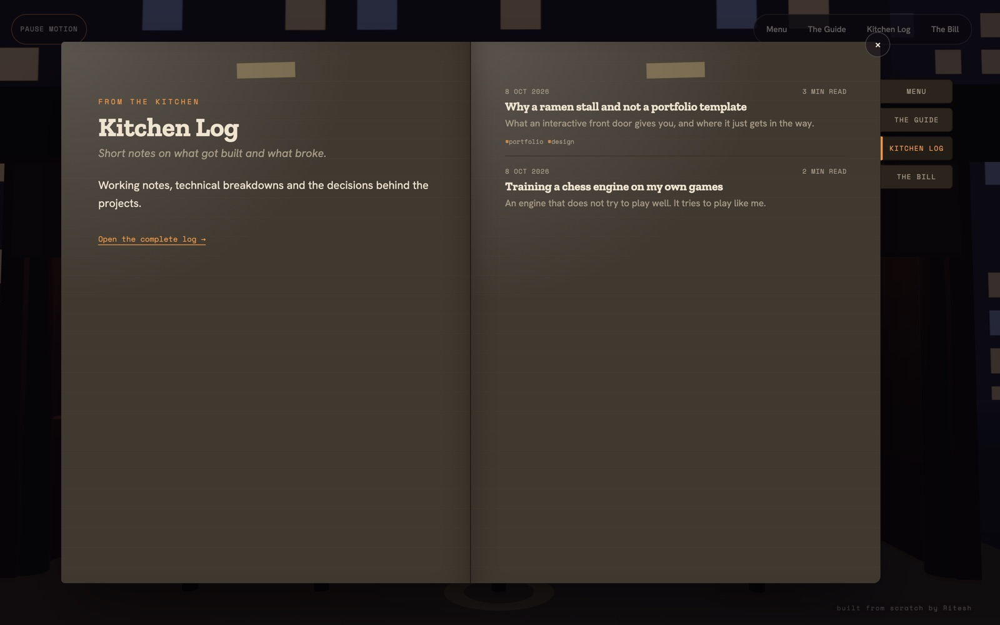
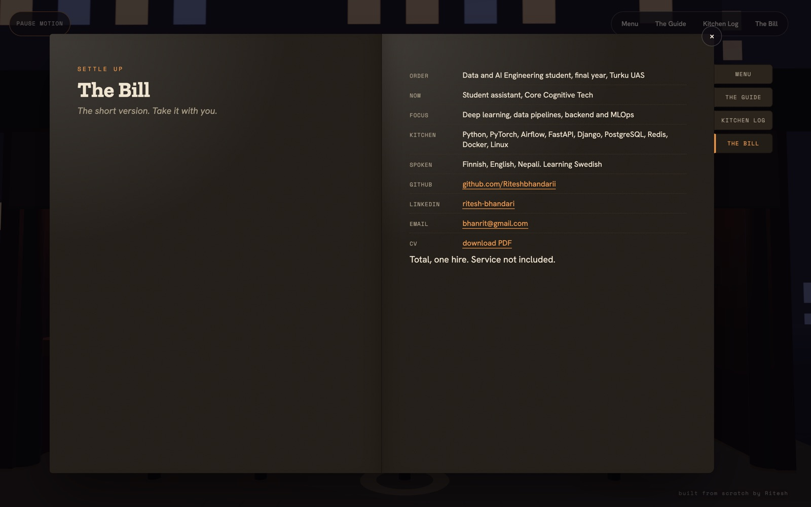

# NightBowl

My portfolio and blog, built as a late-night ramen stall you can walk into.

**Live at [nightbowl.live](https://nightbowl.live)**



Take a seat at the counter, order a bowl, and open the menu book to see my projects, a short introduction, the Kitchen Log and my CV.

| The Guide | Kitchen Log | The Bill |
|---|---|---|
|  |  |  |

## How it is built

- **Astro** renders every page as plain HTML, so the content works without JavaScript and never depends on the 3D scene.
- **three.js** draws the stall, the cook and the diners, all built in code.
- **Keystatic** is the admin. Posts, projects and site text are Markdown and JSON files in this repository.
- **Cloudflare Workers** hosts it on the free plan, with the nightbowl.live domain.

## Run it locally

```bash
npm install
npm run dev   # http://localhost:4321
```

Admin setup, checks and deployment are in [docs/development.md](docs/development.md).
