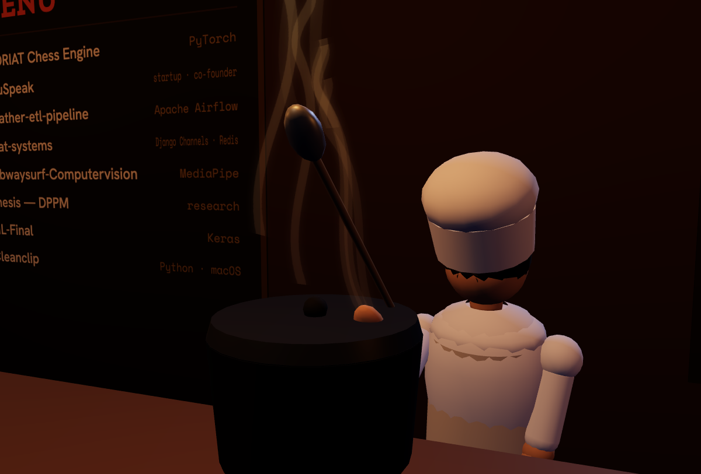
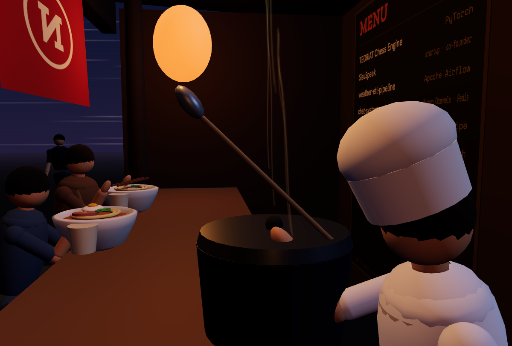
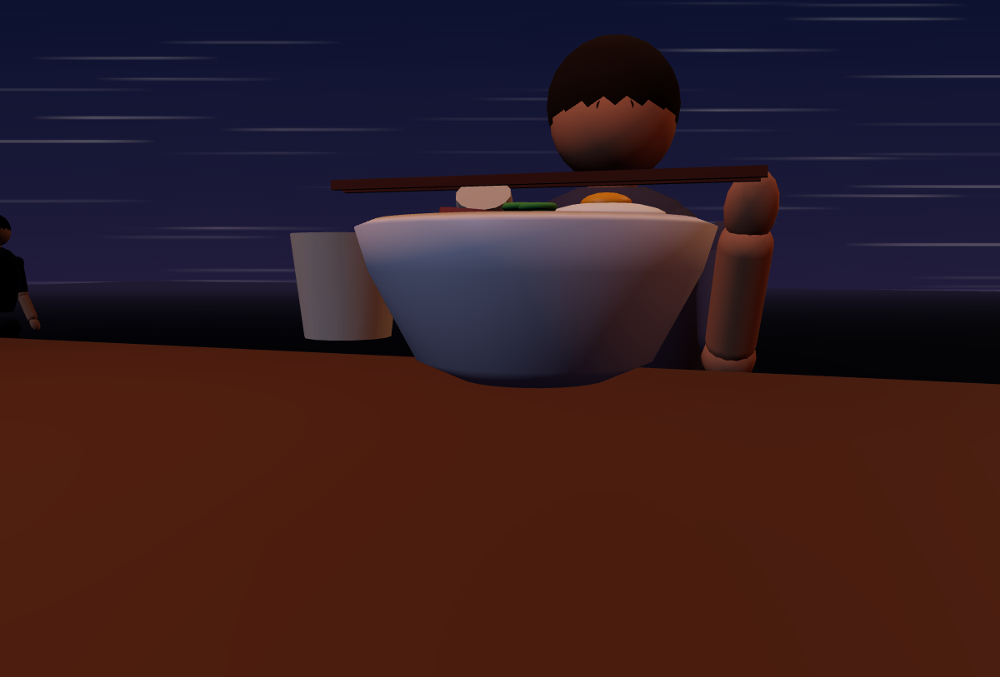
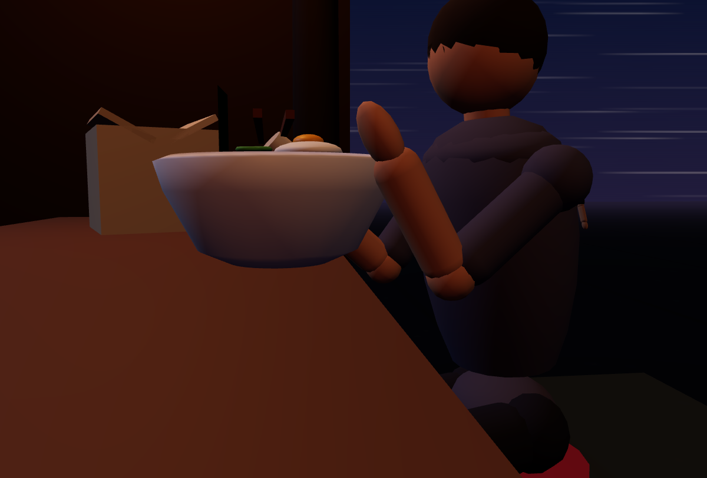
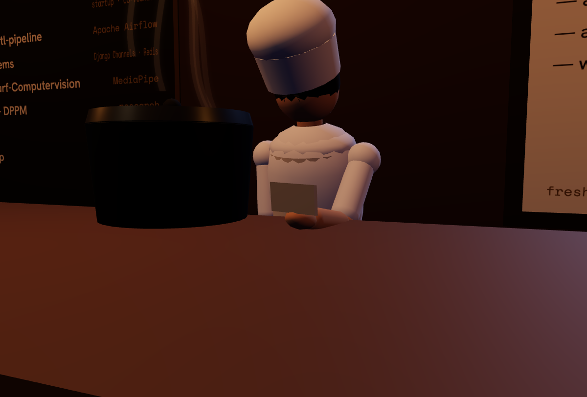
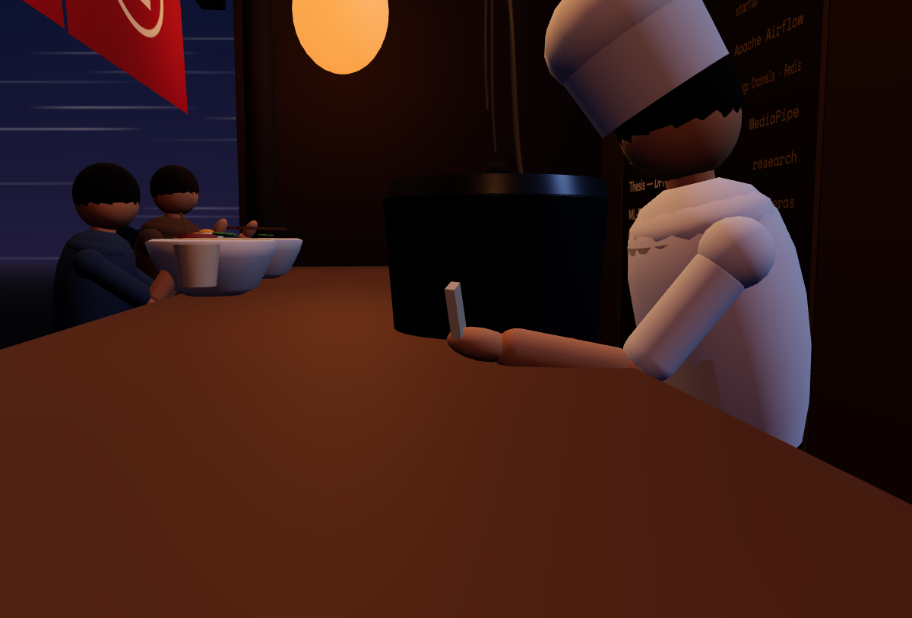
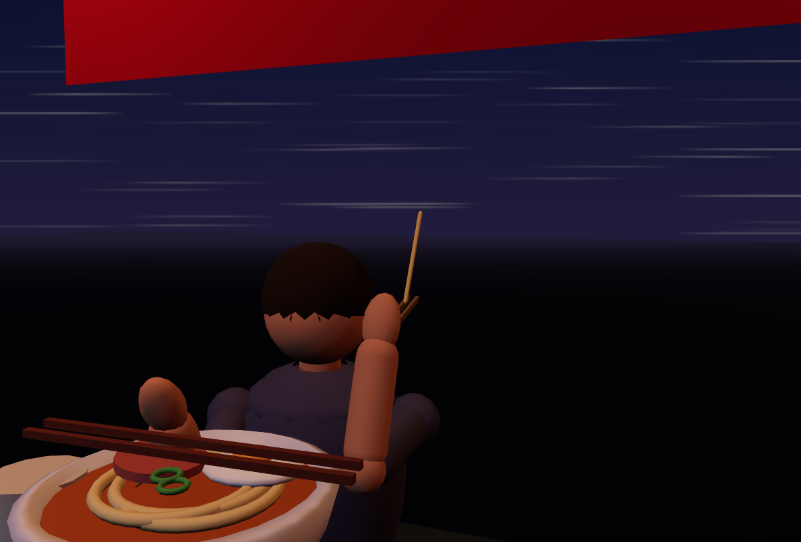
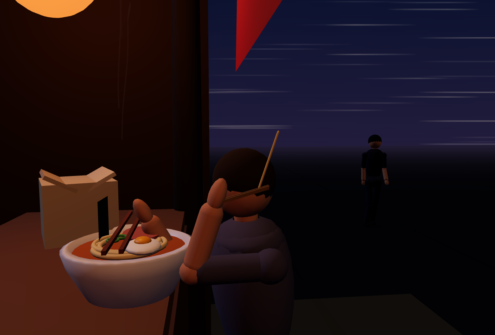
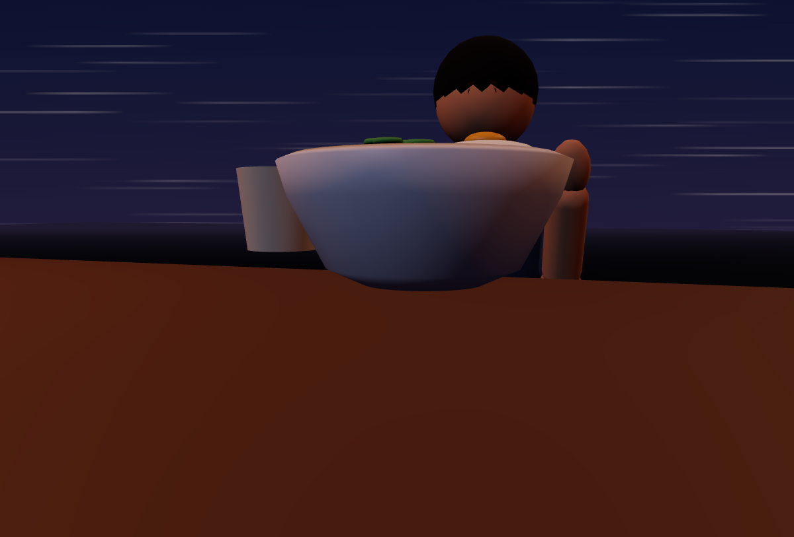
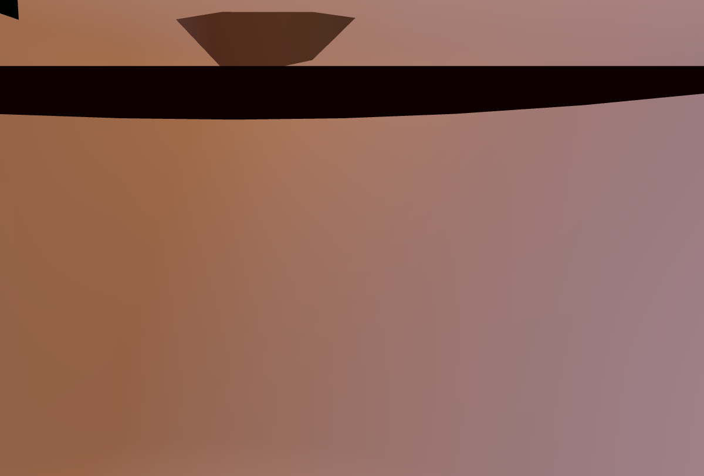

# Pose defects, photographed

Generated by `npm run audit:visual`. Each entry is the worst sample of one
defect that `npm run audit:npc` reports, with the scene frozen at that exact
moment of that exact action. Two angles per defect: a three-quarter view and
a side view, because a limb inside the counter is invisible from the front.

Regenerate after changing a pose. The measurements come from the audit, so
they are the same numbers CI asserts on.

## geometry interpenetration — #29

**handL is 0.113m inside the pot**

cook0 performing `stir` at t=2.4s · id `clip:cook0:stir:handL:pot`

## geometry interpenetration — #28

**forearmL is 0.085m inside the counter top**

diner2 performing `drink` at t=0s · id `clip:diner2:drink:forearmL:counter-top`

## contact miss — #30

**cloth hovers 0.046m above the counter it is wiping**

cook0 performing `wipe` at t=0s · id `contact:cook0:wipe:cloth-counter`

## contact miss — #31

**chopsticks stop 0.035m short of the face at the top of the bite**

diner2 performing `eat` at t=2.15s · id `contact:diner2:eat:chopsticks-mouth`

## geometry interpenetration — #32

**forearmL is 0.011m inside the counter front**

diner1 performing `drink` at t=0s · id `clip:diner1:drink:forearmL:counter-front`

